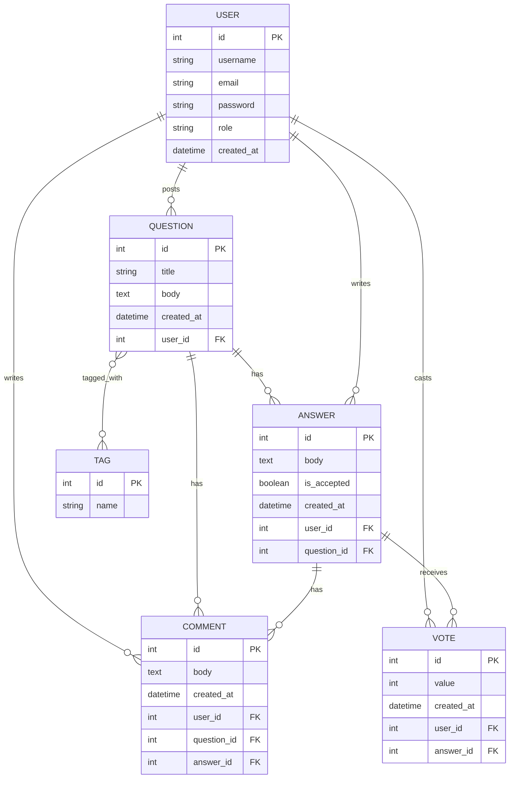

```mermaid
erDiagram

    USER {
        int id PK
        string username
        string email
        string password
        string role
        datetime created_at
    }

    QUESTION {
        int id PK
        string title
        text body
        datetime created_at
        int user_id FK
    }

    ANSWER {
        int id PK
        text body
        boolean is_accepted
        datetime created_at
        int user_id FK
        int question_id FK
    }

    COMMENT {
        int id PK
        text body
        datetime created_at
        int user_id FK
        int question_id FK
        int answer_id FK
    }

    VOTE {
        int id PK
        int value
        datetime created_at
        int user_id FK
        int answer_id FK
    }

    TAG {
        int id PK
        string name
    }

    QUESTION ||--o{ ANSWER : has
    USER ||--o{ QUESTION : posts
    USER ||--o{ ANSWER : writes
    USER ||--o{ COMMENT : writes
    QUESTION ||--o{ COMMENT : has
    ANSWER ||--o{ COMMENT : has
    USER ||--o{ VOTE : casts
    ANSWER ||--o{ VOTE : receives
    QUESTION }o--o{ TAG : tagged_with
```
